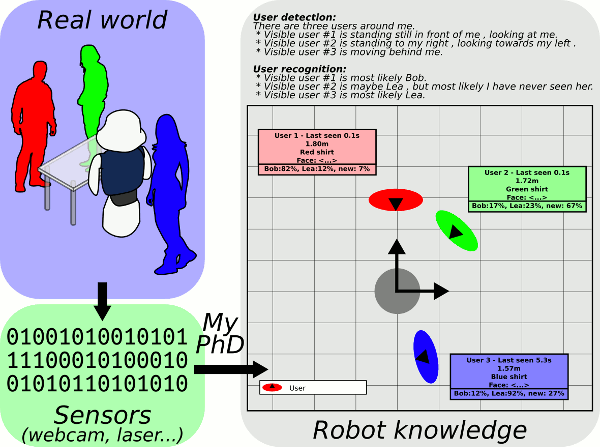

# `people_recognition_vision`

[](https://travis-ci.org/UC3MSocialRobots/people_recognition_vision)



User detection, recognition and tracking is at the heart of Human Robot
Interaction, and yet, to date, no universal robust method exists for being
aware of the people in a robot surroundings. The presented work aims at
importing into existing social robotics platforms different techniques, some
of them classical, and other novel, for detecting, recognizing and tracking
human users. These algorithms are based on a variety of sensors, mainly
cameras and depth imaging devices, but also lasers and microphones. The
results of these parallel algorithms are then merged so as to obtain a
modular, expandable and fast architecture. This results in a local user
mapping thanks to multi-modal fusion.

In this package,
we integrate the different user recognition algorithms:

* **Euclidean distance PPLM**:
  the simplest method to
  estimate the likeliness of a track against a detected PP is
  to compare their 3D position.

* **Face recognition-based PPLM**:
  the visual appearance of the face is key information that the humans use
  extensively to discriminate between people. For this reason, a face
  recognition algorithm was integrated. The algorithm used is ”Fisherfaces”
  [Belhumeur, 1997]

* **Height-based PPLM**:
  We used a novel method for estimating the height of
  the user [Ramey, 2015], based on the depth map and the user mask.

* **NiTE multi-map-based PPLM**
  The raw output of the NiTE algorithm is shaped as a user multimap. The cost
  of matching a given detected PP with the set of tracks is defined as
  follows: this cost is equal to zero if two NiTE user identifiers are equal,
  and equal to one otherwise.

* **PersonHistogramSets**:
  We developed a novel method for user recognition based on color
  histograms [Ramey, 2015], by generating a set of Hue histograms structured
  so as to represented a natural segmentation of the human body. We call
  this set of Hue histograms a PersonHistogramSet (PHS).

For more information, check out
[Arnaud Ramey's PhD](https://sites.google.com/site/rameyarnaud/research/phd).

How to install
==============

## 1. Dependencies from sources

Dependencies handling is based on the [wstool](http://wiki.ros.org/wstool) tool.
Run the following instructions:

```bash
$ sudo apt-get install python-wstool
$ roscd ; cd src
$ wstool init
$ wstool merge `rospack find people_recognition_vision`/dependencies.rosinstall
$ wstool update
```

## 2. Dependencies included in the Ubuntu packages

Please run the [rosdep](http://docs.ros.org/independent/api/rosdep/html/) utility:

```bash
$ sudo apt-get install python-rosdep
$ sudo rosdep init
$ rosdep install people_recognition_vision --ignore-src
```

## 3. Compile

Use [catkin_make](http://wiki.ros.org/catkin/commands/catkin_make):

```bash
$ roscd
$ catkin_make
```

How to cite this work
=====================

Use the following BiB entry

```bib
@phdthesis{
 title = {Local user mapping via multi-modal fusion for social robots},
 type = {phdthesis},
 year = {2015},
 pages = {274},
 websites = {https://sites.google.com/site/rameyarnaud/research/phd},
 institution = {Robotics Lab, Universidad Carlos III, Madrid, Spain},
 id = {f328e23d-c158-3598-a30f-30301cb0087f},
 created = {2015-06-19T17:09:06.000Z},
 file_attached = {false},
 profile_id = {b7924f35-7a80-333d-a823-0bc412c499bd},
 last_modified = {2015-06-22T09:27:23.000Z},
 tags = {Data fusion,Depth image,Image Processing,Kinect,ROS,Robotics,User Awareness},
 authored = {true},
 hidden = {false},
 bibtype = {phdthesis},
 author = {Ramey, Arnaud}
}
```

References
==========

* [Belhumeur, 1997]
Belhumeur, P. (1997). Eigenfaces vs. fisherfaces: Recognition using class
specific linear projection. Pattern Analysis and Machine Intelligence, IEEE
Transactions on.

* [Ramey, 2015]
Cf above "How to cite this work"
